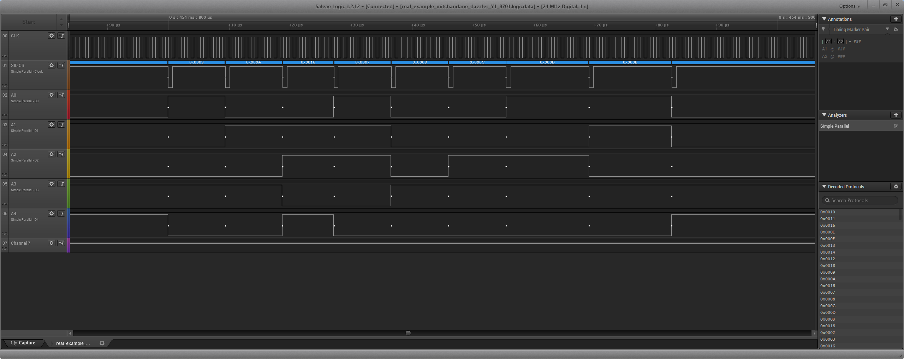

# Emulator

This is actually the core of the whole project. Frankly speaking, designing the wirings was incomparably more straight forward than the challenge of building working emulator. Below you will find a quite brief description of emulator's specification. The 'real' documentation simply doesn't exist yet - in case of any questions I will try to help as much as I can. 

> **NOTE:** Here I'm considering you as a person being in the topic. If I'm wrong, do further reading on your own risk.

## From the Bird's Eye View

You may know why building such a SID player is quite a difficult task, if you're reading this. What problems does one face? For sure memory mapping issues, that's for sure. Then emulation of C64's CPU opcodes itself. Even though one is done with those topics, the performance of host uC becomes an issue. Not mentioning the strict timings for SID registers writes. And last but not least, the correct clock frequency. But let's focus on the emulator itself.

There are few topics to consider:

1. Memory emulation (zero page & stack vs rest of memory space)
2. 6502 CPU opcodes' emulation (both logic and timings)
3. Driving the SID registers

Let's go through the list above.

## Memory

The **ATxmega128A3U** which I used supports linear addressing space, which means all types of memories are placed sequentially in single address space. There's no memory banking available at hand. The internal SRAM memory resides at 0x2000 up to 0x3fff, which gives only 8kB of space. This must be sufficient to manage:

* zero page
* stack
* zak data + routine that plays it

What's more, we are allowed to address only the 0x2000 - 0x3fff space. Let me introduce the "memory virtualization" concept here. By this I mean nothing more than some abstract memory addressing space. Here's the overview of the memory map with comparison of the virtual adresses (the ones that C64's code 'sees') versus the real locations where data are stored in ATxmega128A3U's memory:

Virtual address space (C64) | Real address space (host uC) | Comment
:---: | :---: | :---
`$0000 - $00ff` | `0x3d00 - 0x3dff` | ZP
`$0100 - $01ff` | `0x3e00 - 0x3eff` | Stack
`$0200 - $0fff` | `0x3f00 - 0x3fff` | Memory sink
`$1000 - $2bff` | `0x2000 - 0x3bff` | Zak data
`$2c00 - $2cff` | `0x3c00 - 0x3cff` | Player routine
`$2d00 - $d3ff` | `0x3f00 - 0x3fff` | Memory sink
`$d400 - $d4ff` | n/a | SID addressing space, no memory representation
`$d500 - $ffff` | `0x3f00 - 0x3fff` | Memory sink

As you might have already noticed, there is a one-page-long memory space referred to as **memory sink**. It acts like a garbage dump for writes-to and reads-from all forbidden memory locations. 

> **NOTE:** The location of memory sink is not an ideal option, since ATxmega128A3U's stack is set up at 0x3fff in this project. So, it may be dangerous to write into memory sink as it collides/overlaps the host's stack. Safer would be to give up one memory page of zak's memory, but in 'normal' case when no forbidden memory addresses are used all is fine. Host's stack never grown up (down?) beyond one memory page during my tests, even for a few hours of continous playing.

Take a look at this short example:

Virtual (C64) address | Actual (host uC) address | Remark
:---: | :---: | :---
`$0314` | `0x3f14` | Forbidden, memory sink
`$0803` | `0x3f03` | Forbidden, memory sink
`$fce2` | `0x3fe2` | Forbidden, memory sink
`$0111` | `0x3e11` | OK, it is stack
`$0001` | `0x3d01` | OK, it is zero page
`$1003` | `0x2003` | OK, it is zak

And so on - that's how it works. The one exception from this rule is $d400-$d4ff range. If you read from there, then you get bytes from **memory sink**. If you write to, no memory is modified at all, but instead data are sent directly to the SID chip.

So we have to deal with the **REAL** addresses of uC's memory and the **VIRTUAL** addresses that mimic C64's ones.

Consider the following scenario: you're playing zak that originally resides at $1000 in C64. Here, it's loaded at 0x2000 into ATxmega128A3U's memory, however the zak's player doesn't even notice this. Emulator is "offsetting" addresses at runtime, creating kind of the virtual address space (C64) compared to the physical one (ATxmega128A3U).

Thanks to that, it is possible to load zaks that originally reside at any address in C64's environment into ATxmega128A3U at 0x2000, and play them as if they were loaded at their original locations. It is just about tweaking the offset value.

## Emulation

### How Opcodes Are Processed

I split the single opcode's execution into two main phases (and third one, optional). Each of the two first phases are done during a single C64's cycle. There are no 1-cycle long opcodes in 6502 CPU, so this approach does the job perfectly.

* In the first phase (cycle) the opcode to process is gathered from memory and the addressing mode is obtained
* In the second phase (cycle) all the opcode's logic is processed
* During third and next cycles nothing actually happens, except some standard counters handling etc., but still mainly wasting time (the third phase)

Since the shortest opcode - in terms of execution time - of 6502 CPU takes 2 cycles, we're good with the solution above.

During third and next cycles there's enough time to handle some additional tasks like LCD display or anything, if done wisely. And don't worry, statistically an ordinary program is made of many opcodes longer than 2 cycles.

### The VIC's RASTER register

Can't forget about measuring the time, so we can call player subroutine in proper time intervals. In C64 there is RASTER ($d012) register which provides you with the current line number the raster is in. 

In this project I implemented kind-of RASTER register in memory at $0000 (I found this address not so bad, especially since it's quite unlikely that any player would use it in any way). The way of counting scanlines in its basics relies on counting 6502 cycles. AmiDog put the exact numbers in [this thread](http://www.lemon64.com/forum/viewtopic.php?t=2629&sid=6c1567189e798f520f35938026dc5d77).

However, I simplified things a bit. In PAL system there are 312 scanlines, which is too much to represent in a single byte, so in C64 used one more bit in $d011 making together RASTER register the 9-bit wide. I wanted to keep scanline counter 8-bit wide, therefore I gave up the single-line precision for two-lines one. As a result, the $0000 counter increases two times slower than the original $d012 would do.

In other words, instead of 312 scanlines each of 63 cycles long, here I emulate 156 (312/2) scanlines each of 126 (63*2) cycles long. So the emulator measures time as if the screen was disabled (no bad lines).

> For details about clock circuit please refer to [/docs/CLOCK.md](CLOCK.md) file.

## Writing to SID registers

Now is the fun part where software meets hardware: whenever emulator recognizes write to any of addresses within the scope of $d4 memory page ($d400-$d4ff) it first sets data bus, then address bus and finally pulls /CS line down to inform SID to check its buses. Since the R/W line is allways pulled down (by wiring it to ground permanently - see schematics) SID considers this as a WRITE mode and thus performs writing into addressed register.

> **HINT:** keep in mind that the **/CS line to be effectively recognized by SID as pulled low, must already be low at and lasts low for the time of a HIGH phase of a clock cycle**. Otherwise, you may be gone insane looking for what's wrong with your project. 

Having said that, look at the screenshots below. These are some snapshots of writing to SID registers by emulator. In particular, it's just iterating over SID's registers, from $d400 to $d41f (the data bus is not important here, pay attention to relationship between /CS line, clock line and the address bus):

SID's getting up after host's reset. Once clock signal alives (the CLK channel) emulator holds down /RESET line for - according to specs requirement - at least 10 clock cycles. Here is much longer, just to be sure (RESET line is not visible on this diagram, you can see its impact on the "SID CS" channel being low in the left-side part). After that, the first write is performed, then the second one and so on, together with the down-pulls of the SID CS channel.

Addressing the $d400. Pay attention to SID CS channel changes vs. CLK phase.

Addressing $d40a and then $d40b. Once again, notice the address bus -> SID CS -> CLK line time-relation.

## Real Example

The diagrams below have been taken while playing the **Dazzler** by **Mitch&Dane**. In this example I used external oscillator as a clock source to get CLK line frequency exactly of 0.985MHz.

")
You can see the SID CS channel goes down whenever something happens on the address bus. Each peak in this scale means there were some writings to SID registers. Notice the time between them - it is zak being played once per frame. Now, let's have a closer look into one of those peaks.

Zooming in enough, there are three groups of writings for single frame. Let's have a closer look at the middle one.

Writing into SID registers zoomed in enough to see single clock cycles. 